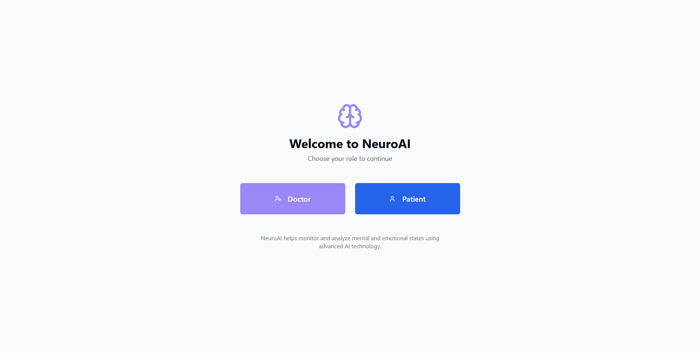
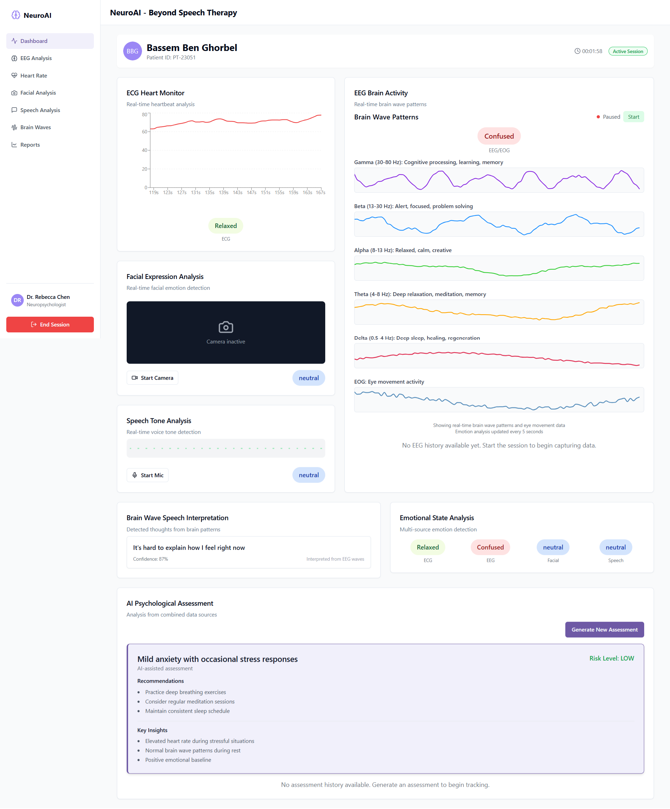
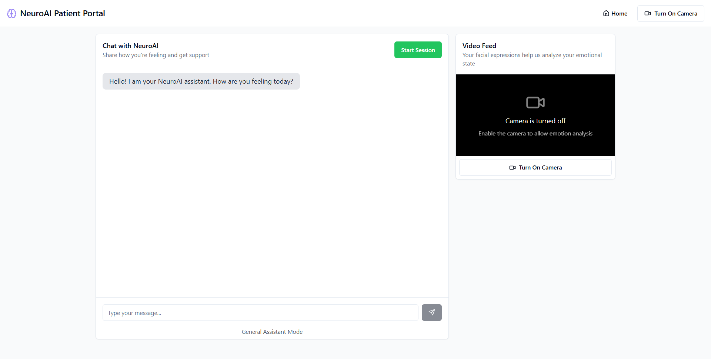

# NeuroAI Dashboard

A Next.js/Vite dashboard that connects to the [NeuroAI Backend](https://github.com/BassemBG/NeuroAI-Backend) every 5 seconds to retrieve and display the predicted emotions from various multi-modal sources.  
Developed as part of **ESE.INFIA0010 — AI Project** at **Esprit School of Engineering**.

## 💻 UI Screenshots

<table>
  <tr>
    <td>
      <strong>🏠 Home Screen</strong><br/>
      
    </td>
    <td rowspan="2">
      <strong>🧑‍⚕️ Psychiatrist Dashboard</strong><br/>
      
    </td>
  </tr>
  <tr>
    <td>
      <strong>🧑‍💬 Patient Portal Agent</strong><br/>
      
    </td>
  </tr>
</table>

## Overview
This project is the frontend dashboard for the NeuroAI platform, a multi-modal approach to help psychiatrists diagnose patients. The dashboard provides a user interface for patients and psychiatrists to interact with the NeuroAI platform.

## Features
- Patient and psychiatrist portals
- Multi-modal approach to emotion recognition
- Real-time emotion recognition and analysis (5-second intervals) for:
  - 🧠 EEG Inner Subconscious state & 👁️ EOG Eye Movement Emotion  
  - 🧠 Brain-to-text interpretation using EEG signals
  - 🧠 EEG duringgaming activity (stimulated)
  - ❤️ ECG-Based Emotion  
  - 👤 Facial Expression Analysis  
  - 🎤 Speech Tone Sentiment  
- Historical interpretations and predicted emotions timeline with offline persistence (LocalStorage). 
- AI assessments via Groq LLM to support the psychiatrist along his session.
- LangChain/ LangFlow agent that analyzes tone and facial expressions from the patient's side in real-time, enabling self-assessment via a dedicated patient portal.
- Responsive UI built with ShadCN + TailwindCSS


## Tech Stack
- **Frameworks**: Next.js, Vite, React
- **Styling**: TailwindCSS, ShadCN UI  
- **State & Storage**: React Hooks, LocalStorage API  
- **AI Agent**: Groq LLM, LangChain, LangFlow, Prompt Engineering.

## Directory Structure

```
root/
│
├── src/
│ ├── components/
│ ├── hooks/
│ ├── lib/
│ ├── pages/
│ └── utils/
│
└── README.md
```

## Getting Started
1. Clone the repository.
2. Install dependencies: `npm install`
3. Start the development server: `npm run dev`

## Usage
The dashboard provides a user interface for patients and psychiatrists to interact with the NeuroAI platform.


## Acknowledgments
This project was developed as part of the coursework for AI project (ESE.INFIA0010) at Esprit School of Engineering.

Special thanks to

- **Prof. Sonia Mesbeh** (sonia.mesbeh@esprit.tn)
- **Prof. Jihene Hlel** (jihene.hlel@esprit.tn)

for their invaluable guidance from ideation and model training through to system architecture and deployment.

## Topics
web-development, nextjs, react, vite, tailwindcss, artificial-intelligence, ai-agent, emotion-recognition, langchain, frontend, eeg, eog, ecg, speech-analysis, ai-healthcare, esprit-school-of-engineering
